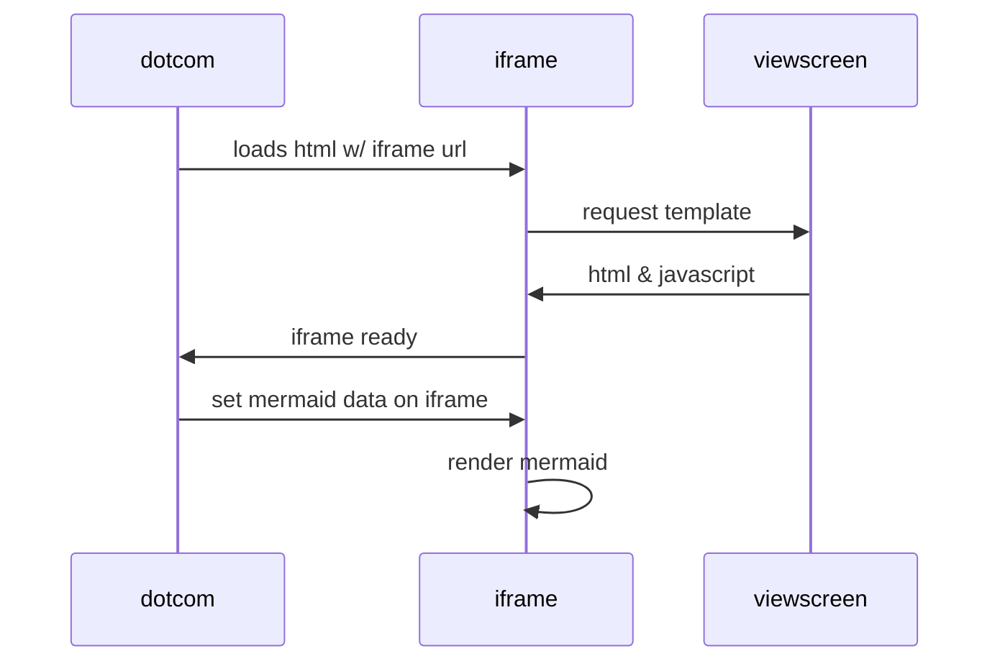

# testing_github_actions_workflow

Test display of SVG files:

Test display of PNG files:

[Workflow Diagram](workflow_diagram.png)

Test of Mermaid:

```mermaid
sequenceDiagram
    participant dotcom
    participant iframe
    participant viewscreen
    dotcom->>iframe: loads html w/ iframe url
    iframe->>viewscreen: request template
    viewscreen->>iframe: html & javascript
    iframe->>dotcom: iframe ready
    dotcom->>iframe: set mermaid data on iframe
    iframe->>iframe: render mermaid
```
